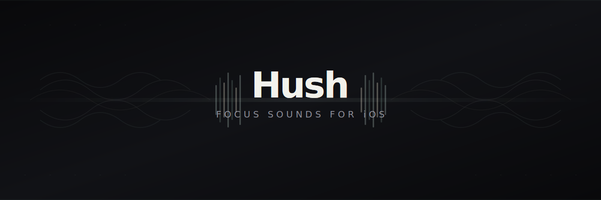

  

  
  
  
  
  

  Real-time DSP noise generators, binaural beats, and a curated library of 80+ ambient recordings 
  — all mixed together in a simple, distraction-free interface.

---

### Noise Generators
White, pink, brown, and gray noise synthesized in real-time.

### Binaural Beats
Alpha, SMR, Beta, and Gamma ranges with configurable carrier frequency.

### Isochronic Tones & Monaural Beats
Alternative brainwave entrainment methods that work with or without headphones.

### 80+ Ambient Sounds
Rain, fire, ocean, birds, cafe, train, forest, and many more — organized by category.

### Layer & Mix
Combine up to 6 sounds with independent volume controls.

### Focus Timer
Built-in timer with fade-out for focused work sessions.

### Built-in Presets

`Focus` `Deep Work` `Sleep` `Calm` `Storm` `Coffee Shop` `Rainy Day` `Forest` `Cozy`

---

### Privacy

No accounts. No analytics. No tracking. Your sounds, your device, your business.

---

## Building

Open `hush.xcodeproj` in Xcode 16+ and build for iOS 18+.

## License

Hush is licensed under the [GNU General Public License v3.0](LICENSE).

## Acknowledgments

- Some ambient sounds are sourced from [Moodist](https://moodist.mvze.net) ([GitHub](https://github.com/remvze/moodist)) by [@remvze](https://github.com/remvze), licensed under MIT
- Sound assets are licensed under:
  - [Pixabay Content License](https://pixabay.com/service/license-summary/)
  - [CC0 (Creative Commons Zero)](https://creativecommons.org/publicdomain/zero/1.0/)

See [LICENSE-THIRD-PARTY](LICENSE-THIRD-PARTY) for full license texts.
